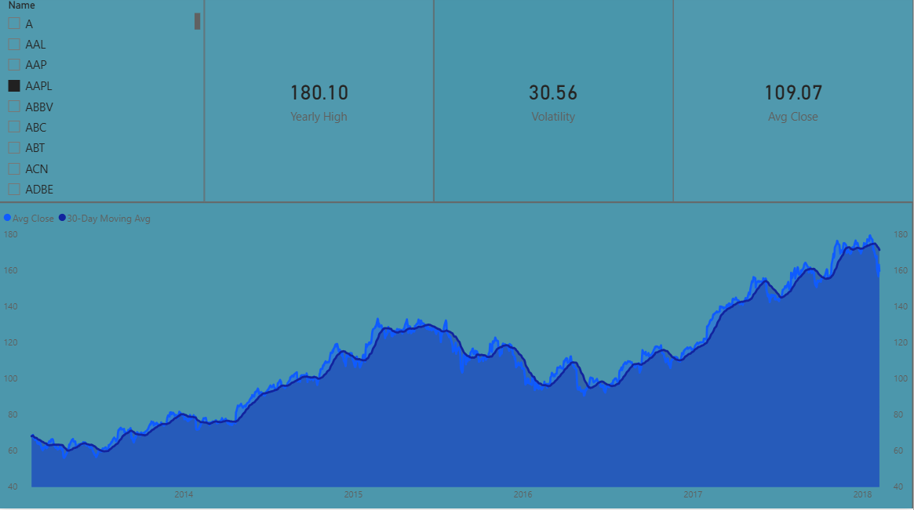
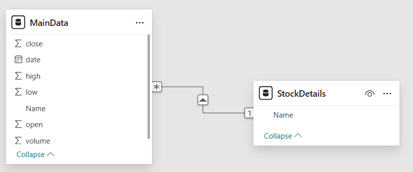

# Financial-Market-Analytics-PowerBI
An end-to-end Power BI project analyzing S&amp;P 500 stock trends using Star Schema modeling and DAX.

# 📈 Equity Market Intelligence Dashboard

## 📌 Project Overview
This Power BI dashboard provides a deep-dive analysis of S&P 500 stock performance. Rather than simple visualization, this project demonstrates **end-to-end business intelligence**—from data cleaning in Power Query to complex statistical modeling in DAX.

### 🖼️ Dashboard Preview

---

## 🛠️ Technical Architecture

### 1. Data Modeling (Star Schema)
I moved away from flat-file processing to implement a **Star Schema** for better performance and scalability:
* **Fact Table (`MainData`):** Stores historical daily pricing and volume.
* **Dimension Table (`StockDetails`):** Provides a unique lookup for tickers, reducing data redundancy.
* **Relationship:** Established a 1:Many relationship between `StockDetails` and `MainData`.

### 2. Advanced DAX Measures
Instead of using raw data columns, I authored custom DAX measures to generate financial insights:
* **Volatility (Risk):** `STDEV.S('MainData'[close])` — Uses standard deviation to measure price stability.
* **30-Day Moving Average:** Utilizes `DATESINPERIOD` and `AVERAGEX` to visualize long-term trends and filter out daily market noise.
* **Price Range:** A dynamic calculation of the delta between daily highs and lows.

### 3. Professional UI/UX
* **Executive Dark Mode:** Designed for high-contrast readability.
* **Dynamic Slicers:** Single-select filtering via the `StockDetails` dimension table.
* **Interactive Tooltips:** Custom hover-over data points showing Volume and High/Low ranges.

## 🖼️ Project Visuals

### Executive Dashboard

### Data Architecture (Star Schema)
*The relationship between MainData and StockDetails*

---

## 🚀 Getting Started
1. Download the `.pbix` file.
2. Open in **Power BI Desktop**.
3. Use the slicer to filter by individual stocks and observe how the **Moving Average** line responds to different market cycles.
